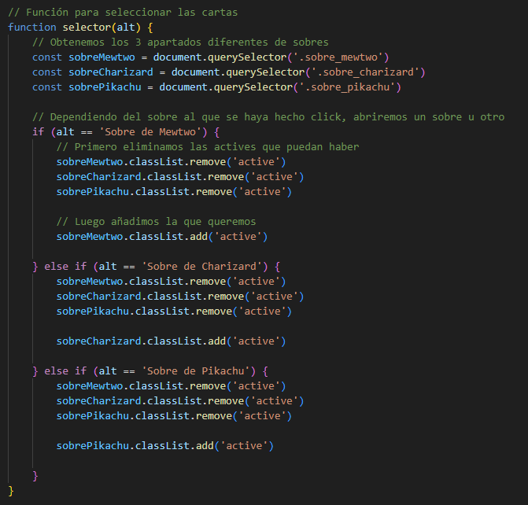
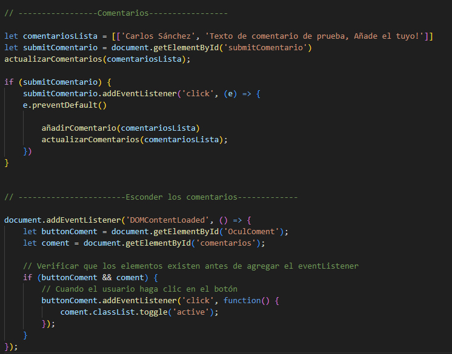

# Documentación Página Web (Pokémon TCGP) 
## 1. La estructura de la página es la siguiente:

 - **/ Pokemon-main**(Carpeta de toda la página web):  
    - **/fonts.**  
        - **pokemon Solid.ttf** (Tipo de letra de los títulos).  
        - **Pokemon_GB.ttf** (Tipo de letra que pertenece al texto general).  
    - **/media.**  (Contiene todas las imágenes de la página web).  
        - **/sobres_charizard.**
        - **/sobres_mewtwo.**
        - **/sobres_pikachu.**
    - **/Pages.** (Contiene las páginas de la web).
        - **detalles.html**
        - **info.html**
        - **sobres.html**
        - **formularios**
    - **/scripts**  
        - **/main.js**
    - **/style.** (Contiene la hoja de CSS).
        - **style.css**

## 2. Tecnologías utilizadas.

#### 2.1. Versión HTML y CSS:

Se utilizó la actual versión de estos: HTML5, CSS3.

 #### 2.2. Visual Studio Code:
Hemos desarrollado la pagina web utilizando el IDE que ayuda al desarrollo de código.

 #### 2.3. GitHub:
Utilizamos la Plataforma GitHub, que nos permite sincrinzar nuestros progresos de la pagina web.

 #### 2.4. Optimizar las imágenes.
 Se ha utilizado la página web: https://www.iloveimg.com/es/convertir-a-jpg para cambiar el formato de la imagenes a .png y .jpeg y optimizar las imágenes utilizadas.
 
 ##### 2.4.1. Ejemplo de optimización:
 Primero se sube la imagen a la pagina web, seguido de esto procedemos a optimizar la imagen:

 

 Podemos ver que ha comprimido la imagen hasta un 63% del tamaño original.
 
 En el caso de nuestra página la carpeta media pesaba al rededor de 30MB, al comprimir las imagenes ahora pesan alrededor 8MB. 

 ## 3- Características y funcionalidades principales de la web.
 Esta página web se podría describir como a un blog sobre el reciente juego de pokémon. Su  función principal es informar a los nuevos jugadores.

#### 3.1. Versión escritorio y versión móvil.

Hemos adaptado la página para todas las resoluciones superiores a un ancho de 350px

 ##### Algunos ejemplo de la versión de escritorio:

 ##### Barra de navegación: 
 

 ##### Secciones:
 

 ##### Sobres:
 

 ##### Forumularios:
 

 ##### Algunos ejemplos de la versión móbil:
 
 ##### Barra de navegación:
 

 ##### Secciones: 
 

 ##### Sobres:
 

 ##### Forumularios:

##  4- Expresiones regulares para la validación.

Debido a los combios de JS, nuestro formulario para añadir comentarios únicamente te pide un nombre de usuario. Por tanto solo tenemos 1 expressión regular de validación. 

Esta expressión regular te pide que pongas 4 letras seguidas de números.

##  5-Modificaciones realizadas(Formularios).

- Se han modificado los **index** de cada pagina web.
- Añadido imagenes a la carpeta **media** y **/media/readme**.
- Añadir la pagina **forumlarios** a la carpeta pages.
- Se añadio un apartado al **CSS** que modifica el banner de la pagina formularios  
- Se ha añadido estilos a los formularios y se les ha hecho resposive.

##  6- Modificaciones realizadas (JavaScript).
- Se han modificado el contenido de **HTML**, el **CSS**
- Tambien se ha añadido un archivo **JavaScript** que añade las siguientes funciones:

###  Funciones.
**Filtro de contenido.** esta función se encarga de filtrar las cartas que hay que cargar en la página, para ello se basa en un campo input, en el que el usuario eligirá la rareza de las cartas que quiere ver.  

 

 Muestra:

 

Para ello hacemos uso de objetos que contienen toda la información de las cartas.
 

----------

**Ampliar imagenes.** Esta función se encarga de ampliar la imagen a la que hemos hecho click, para ello utiliza los datos pasados por parámetro desde el main.

 

  Muestra:

 

----------

**Selector de imagenes.** Esta función se encarga de cargar las imagenes del sobre correspondiente al cuál has hecho click. Utilizamos el parámetro pasado a la función desde el main para saber a que sobre han hecho click.  

 

   Muestra:

 

----------

**Añadir comentarios.** Esta función se encarga de guardar los comentarios puestos en los inputs del formulario y añadirlos a la lista que utilizará la función de cargar comentario para mostrarla por pantalla. Tiene añadido una comprobación de los datos mediante una expresión regular.

 

    Muestra:

 

**Actualizar comentarios.** Esta función se encarga de leer todos los elementos de la lista pasada por parámetro y crear etiquetas "p" dentro de la lista.  

 

    Muestra:

 

----------

**Slider de imagenes.** Esta función se encarga de ir deslizando las imagenes para generar un slider. 

 

     Muestra:

 

----------

###  Main.

En el main está la parte donde se llaman a las demás funciones. Iremos explicandolo poco a poco. 

**LLamada a diversas funciones simples.** En esta parte llamamos a funciones que simplemente hay que llamarlas como pueden ser slider() y cargarCartas(). Pero también tenemos la función del filtro. La cuál añadimos un evento al input para que cada vez que este se cambie llame a la función.  

 

----------

**Llamada a la funciones de Zoom y Selector** En esta parte llamamos a la funciones de zoom y selector. Para ello añado un evento a cada una de las cartas con .ForEach (las imagenes de sobres para seleccionar contenido también son considerados y tratados como si fueran cartas). 

Una vez establecido el evento, con closest() miramos si la carta clickada tiene como padre un elemento con la clase .selectorSobres, en caso afirmativo quiere decir que estamos hablando de un sobre y no una carta. Por tanto este se utilizará para decidir que cartas se mostrarán por pantalla. Una vez sabemos que este es un sobre, llamamos a la función y le pasamos por parámetro el alt del sobre para que luego la función pueda identificar cuál es. 

En caso de haber clickado una carta (lo sabemos porque no tendrá un padre con clase .selectorSobres), llamamos a la función zoom y le pasamos los parámetros necesarios.

 

----------

**Gestón del nav** En esta parte simplemente añadimos un evento al icono de menú para poder desplegarlo en caso de estar en un teléfono o pantalla pequeña.

 

     Muestra:

 

    Muestra desplegado:

 

----------

**Modo claro / oscuro** En esta sección cambiamos los colores al hacer click sobre el icono de modo oscuro.

 

    Muestra del botón para activar el modo oscuro:

 

----------

**Sombra del ratón** En este apartado solo se crea una sombra que sigue al ratón.

 

----------

**Comentarios** El primer bloque tiene la lista de comentarios y un evento en el botón submit que llama a las funciones de añadir comentarios y actualizarlos.

El segundo bloque tiene el evento del botón para enseñar u ocultar la lista de comentarios. Esto se consigue teniendo 2 clases en css, una visible y otra no. Luego desde JavaScript simplemento las vamos alternando con el evento 'click'.

 

----------

##  7- Distribución de tareas.

| **Responsable**  | **Tarea**                                                                                 | **Duración** |
|------------------|-------------------------------------------------------------------------------------------|--------------|
| **Cristian**     | Estructura base de todo el CSS y HTML que se usarán en las demás páginas (Colores, forma de la página, secciones).                                            | 4h           |
|                  | Búsqueda de imágenes y contenido de la página (sobres).                                   | 1h           |
|                  | Ordenar, limpiar y revisar código, añadir decoración al index.html.                       | 4h           |
|                  | Crear el footer y hacer la página index responsive.                                       | 2h           |
|                  | Crear la estructura de la página de sobres.                                               | 4h           |
|                  | Buscar imágenes y optimizar CSS.                                                          | 2h           |
|                  | CSS Tabla.                                                                                | 1h           |
|                  | Correccion de errores.                                                                    | 2h           |
|                  | CSS de la pagina web Formularios + validaciones.                                          | 4h           |
|                  | Añadir función de carga de imágenes mediante objetos de js y adaptar el estilo (JS, HTML y CSS). | 6h           |
|                  | Añadir función de filtros (JS).                                                           | 7h           |
|                  | Añadir función de zoom en las cartas (JS).                                                | 1h           |
|                  | Añadir función de selector sobres, adaptar también el HTML y CSS (JS, HTML, CSS).         | 2h           |
|                  | Añadir función de comentarios (JS).                                                       | 2h           |
|                  | Añadir validación de comentarios.                                                         | 2h           |
|                  | Añadir Slider (JS, HTML, CSS).                                                            | 3h           |
|                  | Añadir menú de navegación propia para móviles (JS, HTML, CSS).                            | 2h           |
|                  | Arreglar el modo claro / oscuro (JS).                                                     | 1h           |
|                  | Retoques generales de bugs y diseño.                                                      | 6h           |
|                  | Modificar Readme.                                                                         | 2h           |
|                  | Gestionar GitHub.                                                                         | 8h           |

| **Responsable**  | **Tarea**                                                                                 | **Duración** |
|------------------|-------------------------------------------------------------------------------------------|--------------|
| **Ivan**         | Añadir información a los objetos (JS).                                                    | 1h           |
|                  | Adaptar la carga de imágenes mediante js al HTML (HTML, CSS).                             | 2h           |
|                  | Añadir función de ocultar/mostrar comentarios y arreglar css (CSS).                       | 2h           |
|                  | Arreglar detalles del Slider (JS, HTML, CSS).                                             | 2h           |
|                  | Modificar el CSS del menú de navegación para móviles (HMTL, CSS).                         | 1h           |
|                  | Añadir sombra al cursor.                                                                  | 3h           |
|                  | Arreglar error de colocación de sobres.                                                   | 1h           |
|                  | Retoques generales de bugs y diseño.                                                      | 5h           |

| **Responsable**  | **Tarea**                                                                                 | **Duración** |
|------------------|-------------------------------------------------------------------------------------------|--------------|
| **Sven**         | Buscar información para el contenido del body.                                            | 2h           |
|                  | Añadir contenido a la página web (Página Principal) y modificar CSS.                      | 30m          |
|                  | Búsqueda de información de la página detalles.                                            | 30m          |
|                  | Crear las páginas web (detalles).                                                         | 1h           |
|                  | Generar el texto de la página web info.                                                   | 30m          |
|                  | Crear las páginas web (info).                                                             | 1h           |
|                  | Creación del MARKDOWN.                                                                    | 2h           |
|                  | Creacion Pagina web(Formularios, sin las validaciones).                                   | 2h           |
|                  | Modificación del README(Explicaciones de las expresiones, Imagenes,etc..).                | 1h           |
|                  | HTML y css de la sección de comentarios (HTML, CSS).                                      | 3h           |
|                  | Modo claro / oscura (JS) .                                                                | 3h           |
|                  | Correcciones de algunos aspectos del modo claro oscuro.                                   | 2h           |
|                  | Actualizazcion del README(JS).                                                            | 2h           |

| **Responsables** | **Tarea**                                                                                 | **Duración** |
|------------------|-------------------------------------------------------------------------------------------|--------------|
| **Sven** y **Cristian**| Ultima revision de la pagina web.                                                   |  2h          |
| **Sven** , **Cristian** y **Ivan**| Ultima revision de la pagina web(JS).                                    |  2h          |